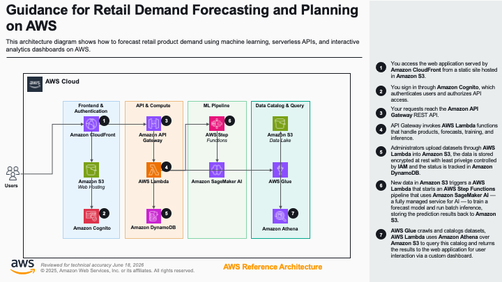

# Guidance for Retail Demand Forecasting on AWS

## Table of Contents

1. [Overview](#overview)
   - [Architecture](#architecture)
   - [AWS Services](#aws-services)
   - [Cost](#cost)
2. [Prerequisites](#prerequisites)
   - [Operating System](#operating-system)
   - [Third-party tools](#third-party-tools)
   - [AWS account requirements](#aws-account-requirements)
   - [aws cdk bootstrap](#aws-cdk-bootstrap)
   - [Supported Regions](#supported-regions)
3. [Automated Deployment](#automated-deployment)
4. [Manual Deployment](#manual-deployment)
5. [Deployment Validation](#deployment-validation)
6. [Running the Guidance](#running-the-guidance)
7. [Next Steps](#next-steps)
8. [Cleanup](#cleanup)
9. [FAQ, known issues, additional considerations, and limitations](#faq-known-issues-additional-considerations-and-limitations)
10. [Notices](#notices)
11. [Authors](#authors)

## Overview

This Guidance demonstrates how retailers can forecast product demand and run price-sensitivity ("what-if") scenarios using a fully serverless, automated machine learning pipeline on AWS. It solves a common merchandising problem: deciding how much inventory to stock and how to price products when demand is uncertain and depends heavily on price.

The Guidance ingests historical sales time-series data, trains a forecasting model with **Amazon SageMaker AI** Autopilot (AutoML), generates batch forecasts, and exposes the results through a web application where merchandisers can explore per-product demand forecasts, project stock coverage, and simulate the demand impact of price changes. The underlying sales data is cataloged with **AWS Glue** and queryable via **Amazon Athena**.

The entire flow is event-driven and automated: uploading a new sales dataset to **Amazon S3** automatically triggers an **AWS Step Functions** pipeline that retrains the model, runs inference, and deploys the updated forecasts with no manual intervention.

### Architecture




**Architecture flow:**

1. Users authenticate through **Amazon Cognito** and access the web application served from **Amazon S3** and distributed by **Amazon CloudFront**.
2. The single-page application calls a REST API on **Amazon API Gateway**, which is protected by a Cognito authorizer.
3. API Gateway routes requests to **AWS Lambda** functions that handle products, forecasts, training, inference, analytics, and dataset upload operations.
4. Historical sales data and product metadata are stored in **Amazon S3**. An administrator can upload a new sales dataset (ZIP) through the application; a Lambda function unpacks it and writes it back to S3.
5. Uploading the sales dataset to S3 emits an event that starts an **AWS Step Functions** state machine, which orchestrates the end-to-end ML workflow.
6. The state machine invokes Lambda functions that run an **Amazon SageMaker AI** Autopilot training job, create a model, run a batch transform for inference, and optionally deploy a real-time endpoint.
7. Forecast outputs are written to **Amazon S3**. Upload status is tracked in **Amazon DynamoDB**.
8. **AWS Glue** catalogs the sales data and **Amazon Athena** provides SQL access over it in S3.

### AWS Services

| AWS service                                                             | Role in this Guidance                                                                        |
| ----------------------------------------------------------------------- | -------------------------------------------------------------------------------------------- |
| [Amazon CloudFront](https://aws.amazon.com/cloudfront/)                 | Content delivery for the web application                                                     |
| [Amazon S3](https://aws.amazon.com/s3/)                                 | Hosts the web app and stores raw data, model artifacts, forecast outputs, and Athena results |
| [Amazon Cognito](https://aws.amazon.com/cognito/)                       | User authentication (User Pool and Identity Pool)                                            |
| [Amazon API Gateway](https://aws.amazon.com/api-gateway/)               | REST API for the application backend                                                         |
| [AWS Lambda](https://aws.amazon.com/lambda/)                            | Serverless compute for API handlers and pipeline steps                                       |
| [Amazon DynamoDB](https://aws.amazon.com/dynamodb/)                     | Tracks dataset upload status                                                                 |
| [AWS Step Functions](https://aws.amazon.com/step-functions/)            | Orchestrates the automated training and inference pipeline                                   |
| [Amazon SageMaker AI](https://aws.amazon.com/sagemaker/)                | Autopilot (AutoML) training, batch transform, and real-time inference                        |
| [AWS Glue](https://aws.amazon.com/glue/)                                | Data catalog and schema crawling for sales data                                              |
| [Amazon Athena](https://aws.amazon.com/athena/)                         | SQL queries over the sales data in S3                                                        |
| [AWS Identity and Access Management (IAM)](https://aws.amazon.com/iam/) | Service roles and least-privilege access policies                                            |

### Cost

You are responsible for the cost of the AWS services used while running this Guidance. As of June 2026, the cost for running this Guidance with the default settings in the US East (N. Virginia) Region is approximately **$299.00 per month** for processing (8,900 records). This **includes a SageMaker real-time endpoint that the ML pipeline creates by default**; if you do not need the interactive price what-if feature, deleting that endpoint lowers the cost to approximately **$131.00 per month** (see the note below the table).

We recommend creating a [Budget](https://docs.aws.amazon.com/cost-management/latest/userguide/budgets-managing-costs.html) through [AWS Cost Explorer](https://aws.amazon.com/aws-cost-management/aws-cost-explorer/) to help manage costs. Prices are subject to change. For full details, refer to the pricing webpage for each AWS service used in this Guidance.

#### Sample Cost Table

The following table provides a sample cost breakdown for deploying this Guidance with the default parameters in the US East (N. Virginia) Region for one month.

| AWS service                       | Dimensions                                                                                                        | Cost [USD]   |
| --------------------------------- | ----------------------------------------------------------------------------------------------------------------- | ------------ |
| Amazon SageMaker AI               | ~4 Autopilot (AutoML) training jobs + batch transform on `ml.m5.4xlarge`                                          | $ 120.00     |
| Amazon SageMaker AI               | Real-time inference endpoint `ml.m5.xlarge` (1 instance) — **created by default** by the pipeline; delete to stop | $ 168.00     |
| Amazon API Gateway                | ~1,000,000 REST API calls per month                                                                               | $ 3.50       |
| Amazon S3                         | ~10 GB across the data, logs, and website buckets                                                                 | $ 2.00       |
| AWS Lambda                        | ~100,000 invocations, 256 MB average                                                                              | $ 1.00       |
| Amazon Athena                     | ~0.2 TB scanned per month                                                                                         | $ 1.00       |
| AWS Glue                          | Crawler runs (~10 DPU-hours per month)                                                                            | $ 1.00       |
| Amazon DynamoDB                   | On-demand, <1 GB storage, light read/write                                                                        | $ 1.00       |
| Amazon CloudFront                 | PriceClass 100, ~10 GB data transfer out                                                                          | $ 1.00       |
| AWS Step Functions                | ~50 state transitions per pipeline run                                                                            | $ 0.50       |
| Amazon Cognito                    | <50,000 monthly active users (free tier)                                                                          | $ 0.00       |
| **Total (with default endpoint)** |                                                                                                                   | **$ 299.00** |
| **Total (endpoint deleted)**      |                                                                                                                   | **$ 131.00** |

> SageMaker AI is the primary cost driver. Training cost scales with the number and frequency of Autopilot jobs and the instance type selected.
>
> **Real-time endpoint — created by default, can be turned down:** The ML pipeline deploys a SageMaker real-time endpoint (`ml.m5.xlarge`, 1 instance) as its final step, so it is **running by default** after a training run and is billed **per instance-hour for as long as it exists** — roughly **$0.23/hour (~$168/month if left running 24/7)** — regardless of whether any prediction is requested. It powers **only** the interactive **price what-if** feature; demand forecasts, stock projection, and the batch-generated price scenarios all work without it. To stop the charge, delete the endpoint from the SageMaker console (**Inference → Endpoints → select → Delete**) or via the CLI (`aws sagemaker delete-endpoint --endpoint-name <name>`). Verify current rates on the [Amazon SageMaker pricing page](https://aws.amazon.com/sagemaker/pricing/).

## Prerequisites

### Operating System

These deployment instructions are optimized to best work on **Amazon Linux 2023**. Deployment in another OS (macOS, other Linux distributions, or Windows via WSL2) may require additional steps.

The following packages are required and are not all available by default in the base AMI:

- **Node.js 20.x** and **npm 10.x** (CDK app, Lambda bundling, and the Next.js frontend)
- **AWS CDK** `2.244.0` or later — install with `npm install -g aws-cdk`
- **AWS CLI v2** — used by the deployment script to read CloudFormation exports and sync the frontend
- **jq** — used by the deployment script to read configuration from `cdk.json`
- **Git** — to clone the repository

Install commands on Amazon Linux 2023:

```bash
# Node.js 20.x
curl -fsSL https://rpm.nodesource.com/setup_20.x | sudo bash -
sudo yum install -y nodejs git jq

# AWS CDK
npm install -g aws-cdk
```

### Third-party tools

No third-party (non-AWS) tools are required beyond the standard developer tooling listed above. The frontend is built with [Next.js](https://nextjs.org/) and the AWS Amplify libraries; the infrastructure is defined with the AWS CDK in TypeScript.

### AWS account requirements

This deployment requires the following in your AWS account:

- **Amazon SageMaker AI access** — the account must be able to run Autopilot (AutoML) jobs and create models, transform jobs, and endpoints.
- **IAM permissions** to create the resources defined by the CDK stacks (S3, CloudFront, Cognito, API Gateway, Lambda, DynamoDB, Step Functions, Glue, Athena, SageMaker, and IAM roles).

### aws cdk bootstrap

This Guidance uses the AWS CDK. If you are using the AWS CDK in this account and Region for the first time, you must bootstrap the environment before deploying:

```bash
cdk bootstrap aws://<account-id>/<region>
```

The automated deployment script runs `cdk bootstrap` for you.

### Supported Regions

This Guidance is built and tested in **US East (N. Virginia) — `us-east-1`**, which is the default Region. It can be deployed to any AWS Region where all of the services listed in [AWS Services](#aws-services) are available — most notably Amazon SageMaker AI Autopilot. To change the Region, set `context.accounts.dev.region` in `deployment/cdk/cdk.json` — this is the single source of truth that both the CDK app and `deploy.sh` read, so you do not also need to set `AWS_REGION`.

## Automated Deployment

This section provides the quickest path to deploy the Guidance using the automated deployment script.

A one-click deploy script, `scripts/deploy.sh`, deploys all CDK stacks, builds and uploads the frontend, and wires the frontend to the deployed backend. It is cross-platform (macOS, Linux, Windows via WSL/Git Bash), checks prerequisites, and bootstraps the CDK environment if needed.

**Usage:**

```bash
# Clone the repository
git clone <repository-url>
cd retail-demand-forecasting-solution-guidance

# Run the deploy script (set ADMIN_EMAIL to grant yourself admin access)
ADMIN_EMAIL=you@example.com ./scripts/deploy.sh
```

To deploy and immediately start the ML training pipeline, pass the `--train` flag:

```bash
ADMIN_EMAIL=you@example.com ./scripts/deploy.sh --train
```

> A thin `./deploy.sh` wrapper at the repository root is also provided and simply calls `scripts/deploy.sh`.

> **Admin access:** `ADMIN_EMAIL` is the address added to the Cognito `Admin` group on first sign-in (use a comma-separated list for multiple admins, e.g. `ADMIN_EMAIL="a@x.com,b@x.com"`). Sign up in the app with that exact email, then **sign out and back in once** so your token carries the `Admin` group claim before using the admin features. If `ADMIN_EMAIL` is omitted, the `adminEmails` value from `cdk.json` is used.

**What the script does:**

- Detects your platform and checks prerequisites (AWS CLI, Node.js, npm, jq, credentials)
- Installs dependencies (`npm ci`) for the workspaces monorepo
- Bootstraps the CDK environment (if not already bootstrapped) and deploys all six stacks
- Reads the deployed API, Cognito, S3, and CloudFront values from CloudFormation exports
- Builds the Next.js frontend with the correct runtime configuration and syncs it to the website S3 bucket
- Invalidates the CloudFront cache, validates the outputs, and prints the application URL
- Optionally starts the Step Functions training pipeline when `--train` is passed
- Prints cleanup instructions (including how to delete the SageMaker endpoint)

**Environment:**

- Designed to run on Amazon Linux 2023 (EC2 or AWS CodeBuild) or locally on macOS/Linux
- Requires the AWS CLI configured with credentials for the target account

> **Before deploying**, review `deployment/cdk/cdk.json` and update the `context` values for your environment (see step 3 in [Manual Deployment](#manual-deployment)). For a detailed understanding of each deployment step, see the [Manual Deployment](#manual-deployment) section below.

## Manual Deployment

Use these steps if you want to understand or customize each part of the deployment.

1. Clone the repository:

   ```bash
   git clone <repository-url>
   cd retail-demand-forecasting-solution-guidance
   ```

2. Install dependencies for the CDK app and the frontend:

   ```bash
   cd deployment/cdk && npm ci && cd ../..
   cd source/frontend && npm ci && cd ../..
   ```

3. Edit `deployment/cdk/cdk.json` and update the `context` block for your environment:
   - `accounts.dev.region` — your target Region (default `us-east-1`)
   - `adminEmails` — email address(es) added to the `Admin` Cognito group on first sign-in. You can set this here, or override it at deploy time with the `ADMIN_EMAIL` environment variable (see step 5). **If this is left as the placeholder and no `ADMIN_EMAIL` is provided, no user will get admin access.**

   The deployment account is taken from your active AWS credentials (`CDK_DEFAULT_ACCOUNT`), so it does not need to be set in `cdk.json`.

4. Bootstrap the CDK environment (first-time users only):

   ```bash
   cd deployment/cdk
   npx cdk bootstrap
   ```

5. Build and deploy all stacks (optionally override the admin email via `--context`):

   ```bash
   npm run build
   npx cdk deploy --all --require-approval never --context adminEmails=you@example.com
   cd ../..
   ```

   This deploys six stacks: `RetailForecast-DataStack`, `RetailForecast-FrontendStack`, `RetailForecast-AuthStack`, `RetailForecast-MLStack`, `RetailForecast-BackendStack`, and `RetailForecast-PipelineStack`.

6. Capture the deployed resource values from CloudFormation exports:

   ```bash
   REGION=$(jq -r '.context.accounts.dev.region' deployment/cdk/cdk.json)
   aws cloudformation list-exports \
     --query "Exports[?Name=='ApiUrl' || Name=='WebsiteBucketName' || Name=='DistributionId' || Name=='DistributionDomainName' || Name=='UserPoolId' || Name=='UserPoolClientId' || Name=='IdentityPoolId'].[Name,Value]" \
     --output table --region "$REGION"
   ```

7. Build the frontend with the captured values and deploy it to the website bucket (the automated script performs this step for you using the exported values):

   ```bash
   cd source/frontend
   NEXT_PUBLIC_API_URL="<ApiUrl>" \
   NEXT_PUBLIC_USER_POOL_ID="<UserPoolId>" \
   NEXT_PUBLIC_USER_POOL_CLIENT_ID="<UserPoolClientId>" \
   NEXT_PUBLIC_IDENTITY_POOL_ID="<IdentityPoolId>" \
   NEXT_PUBLIC_REGION="$REGION" \
   npm run build
   aws s3 sync out/ "s3://<WebsiteBucketName>/" --delete
   aws cloudfront create-invalidation --distribution-id "<DistributionId>" --paths "/*"
   cd ../..
   ```

8. Open the application at `https://<DistributionDomainName>`.

## Deployment Validation

- Open the **AWS CloudFormation** console and verify that all six stacks with names starting with `RetailForecast-` show a status of `CREATE_COMPLETE`.
- Confirm the API is reachable. The following command should return the API Gateway URL (replace the Region if you changed it in `cdk.json`):

  ```bash
  REGION=$(jq -r '.context.accounts.dev.region' deployment/cdk/cdk.json)
  aws cloudformation list-exports \
    --query "Exports[?Name=='ApiUrl'].Value" --output text --region "$REGION"
  ```

- Verify the Step Functions state machine exists:

  ```bash
  aws stepfunctions list-state-machines \
    --query "stateMachines[?contains(name,'retail-forecast')].name" \
    --output text --region "$REGION"
  ```

- Open the CloudFront URL printed by the deployment script in a browser. You should see the application sign-in page.

## Running the Guidance

The Guidance ships with sample data so you can run it end to end immediately.

**Guidance inputs:**

- Sample historical sales time-series data (`assets/data/consumer_electronics.csv`, ~8,900 rows) and product metadata (`assets/data/products_metadata.csv`) are deployed to the raw data S3 bucket automatically.
- A sample upload archive is available at `assets/test-data/sample_sales.zip` for testing the in-app dataset upload feature.

**Steps to run:**

1. Sign in to the application using the CloudFront URL. On the sign-in page, choose **Sign up** to create an account, verify your email with the code Amazon Cognito sends, then sign in. To use the admin features, sign up with an address provided via `ADMIN_EMAIL` (or `adminEmails` in `cdk.json`), then **sign out and sign back in once** — the `Admin` group is applied at sign-in, so the new group claim only appears in your token after a fresh login.

2. Start the ML pipeline. Either pass `--train` to the deploy script, or start the state machine directly:

   ```bash
   REGION=$(jq -r '.context.accounts.dev.region' deployment/cdk/cdk.json)
   SM_ARN=$(aws stepfunctions list-state-machines \
     --query "stateMachines[?contains(name,'retail-forecast')].stateMachineArn" \
     --output text --region "$REGION")
   aws stepfunctions start-execution --state-machine-arn "$SM_ARN" --input '{}' --region "$REGION"
   ```

   The pipeline trains an Autopilot model, runs batch inference, and writes forecast outputs to the outputs S3 bucket. The SageMaker Autopilot time-series job typically takes 1–3 hours.

3. In the web application, browse products, open a product to view its demand forecast and stock projection, and use the **what-if** feature to simulate the demand impact of a price change.

   > The interactive **price what-if** (predicting demand at a price you choose) calls a live SageMaker real-time endpoint. The pipeline **creates this endpoint by default** as its last step, so it is running (and billing per hour) after a training run. It powers only the price what-if — demand forecasts and stock projection work without it. When you don't need it, delete the endpoint from the SageMaker console (**Inference → Endpoints → Delete**) or via the CLI (see [Cost](#cost) and [Cleanup](#cleanup)).

**Expected output:**

- The Step Functions execution reaches the `PipelineSucceeded` state.
- Forecast output files appear in the `retail-forecast-outputs-<account>-<region>` S3 bucket.
- The application displays per-product demand forecasts, stock projections, and what-if price scenarios.

## Next Steps

- **Bring your own data.** Replace the sample CSVs with your own sales history and product metadata (matching the column schema in `assets/data/`), or upload a new dataset through the application's admin upload feature to automatically retrain.
- **Tune the model.** Adjust the SageMaker AI Autopilot job configuration (target metric, training time, instance type) in the pipeline Lambda functions under `source/lambda/pipeline/` to trade off accuracy against cost.
- **Schedule retraining.** Add an Amazon EventBridge schedule to start the Step Functions pipeline on a recurring cadence instead of only on data upload.
- **Extend the API.** Add new Lambda-backed endpoints in `deployment/cdk/lib/stacks/backend-stack.ts` for additional forecasting or merchandising features.
- **Harden for production.** Restrict the S3 CORS and API Gateway CORS origins (currently `*`) to your application domain, and scope the wildcard IAM resource permissions to specific resources.

## Cleanup

1. Destroy all CDK stacks:

   ```bash
   cd deployment/cdk
   npx cdk destroy --all
   cd ../..
   ```

   The S3 buckets are configured with `autoDeleteObjects`, so their contents are removed automatically when the stacks are destroyed.

2. Delete any SageMaker AI real-time endpoint that was deployed outside the stack lifecycle (endpoints are billed per hour while running):

   ```bash
   REGION=$(jq -r '.context.accounts.dev.region' deployment/cdk/cdk.json)
   aws sagemaker list-endpoints --region "$REGION"
   aws sagemaker delete-endpoint --endpoint-name <endpoint-name> --region "$REGION"
   ```

3. (Optional) Remove the CDK bootstrap stack (`CDKToolkit`) if you no longer use the CDK in this account and Region.

## FAQ, known issues, additional considerations, and limitations

**Additional considerations:**

- This Guidance is intended as a proof of concept. Some IAM policies use wildcard (`*`) resources for SageMaker `List*` actions, which do not support resource-level permissions. Review and scope all permissions before production use.
- Authentication uses a standard Amazon Cognito user pool with self sign-up and email verification enabled. Update `adminEmails` in `cdk.json` to your own values, and set your target Region via `accounts.dev.region` (the deployment account comes from your AWS credentials). Note that self sign-up is open — anyone with a valid email can register; for production, restrict registration (for example, a pre-sign-up Lambda trigger that allow-lists email domains, or admin-created users only).
- Amazon SageMaker AI Autopilot jobs and any deployed real-time endpoint incur cost while running irrespective of application usage. Delete endpoints when not in use.
- The included datasets are synthetic sample data for demonstration purposes only.

**Known issues:**

- None at this time.

For any feedback, questions, or suggestions, please use the issues tab under this repo.

## Notices

_Customers are responsible for making their own independent assessment of the information in this Guidance. This Guidance: (a) is for informational purposes only, (b) represents AWS current product offerings and practices, which are subject to change without notice, and (c) does not create any commitments or assurances from AWS and its affiliates, suppliers or licensors. AWS products or services are provided "as is" without warranties, representations, or conditions of any kind, whether express or implied. AWS responsibilities and liabilities to its customers are controlled by AWS agreements, and this Guidance is not part of, nor does it modify, any agreement between AWS and its customers._

## Authors

- Retail Demand Forecasting Guidance team
